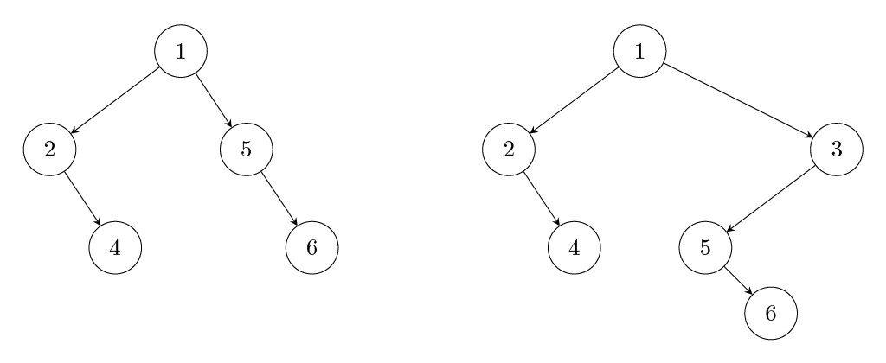

# 8. Amortised analysis

So far we have analysed algorithms by bounding each basic step and then multiplying by the number of steps. For example, inserting a new element to the binary search tree takes $$O(\log n)$$ time, so inserting $$n$$ elements takes $$O(n \log n)$$ time. There are cases, where such analysis can be pessimistic. in such cases, we need to refine our analyses using amortisation; we can <i>amortise</i> work done on expensive steps to lighter steps to bound the overall work. 

## Sliding window minima

Recall that we solved the following sliding window minima problem in $$O(n \log n)$$ time using heaps.

{: .note-title }
Task

You are given a list of $$n$$ numbers and a parameter $$k$$. For each _sliding window_, i.e., a sublist of $$k$$ consecutive elements, from the left to right, find the smallest element in the sublist.

For example, when the list is $$[1,2,3,5,4,4,1,2]$$ and $$k=3$$, the desired answer is $$[1,2,3,4,1,1]$$. Here the sublists are $$[1,2,3]$$, $$[2,3,5]$$, $$[3,5,4]$$, $$[5,4,4]$$, $$[4,4,1]$$ and $$[4,1,2]$$.

It turns out that the problem can be solved in $$O(n)$$ time with an algorithm whose analysis requires use of amortisation. The algorithm works as follows: We maintain a deque containing pairs $$<i,v>$$, where $$i$$ is the position of value $$v=L[i]$$ in the input list $$L$$. We require that (i) the deque contains only elements from the current sublist when sliding window from left to right; and (ii) both elements of the pair are increasing. These properties ensure that the sublist minimum value is always the left-most element in the deque and that the deque maintains only values that have a possibility to become minimum value in a future window. Let us detail how the deque can be efficiently updated to maintain these properties. We explain the updates through simulating our example above.
The deque for the first sublist (with $$k=3$$) would contain all pairs $$[<1,1>,<2,2><3,3>]$$. Consider updating the deque to the next sublist: First we check if the left-most pair, here $$<1,1>$$ is outside the window, which is the case and we pop it from the queue. Next, to maintain the non-decreasing property, we pop all elements from the right that are not smaller than the value of the new pair $$<4,5>$$ we plan to push. In this case, nothing is popped from the right and the deque content becomes $$[<2,2><3,3>,<4,5>]$$ after we push the newest pair. When moving to the next sublist, we pop $$<2,2>$$ from the left as well as $$<4,5>$$ from the right, as the value $$4$$ of the new pair $$<5,4>$$ is smaller than $$5$$. The deque becomes $$[<3,3>,<5,4>]$$ after pushing the new pair to the right. Continuing like this, the deque contents for the remaining sublists are $$[<6,4>]$$, $$[<7,1>]$$, $$[<7,1>,<8,2>]$$. To complete the description, the content of the deque for the first sublist can be computed starting from an empty deque and inserting elements just as described before, omitting popping the first element until the sliding window has reached the end of the first sublist.

Let us now analyse the running time of this algorithm. At first, it might seem that the work can be $$O(kn)$$ as pushing a small value to the right might cause $$k$$ elements to be popped out from the right. However, this cannot happen at every step. Indeed, changing the angle in the analysis helps: Any pair $$<i,v>$$ is pushed exactly once to the deque and thus can also be popped out only once. The total running time is linear in the number of push and pop operations, which each take constant time on a deque (implemented as a doubly-linked list). That is, the algorithm takes $$O(n)$$ time.   

## Cartesian tree construction

Cartesian tree is a binary tree built on a list of values such that the root is the minimum value in the input list $$L[1,2,...,n]$$, say at position $$i$$, and the left and right subtrees are recursively defined as Cartesian trees of $$L[1,2,..,i-1]$$ and $$L[i+1,i+2,..,n]$$. Figure below illustrates the structure on $$[2,4,1,5,6]$$ and on $$[2,4,1,5,6,3]$$.

Naive construction deriving from the definition takes $$O(n^2)$$ time. A linear-time algorithm can be derived using an idea similar to the sliding window minima above: Assume the Cartesian tree $$C(j)$$ of $$L[1,2,..,j]$$ for some $$j$$ has already been constructed. Our goal is to construct $$C(j+1)$$. That is, in our example above we start from the tree on the left and want to contruct the tree on the right, appending value $$3$$ to the right. Since $$L[j+1]$$ cannot have a right subtree in $$C(j+1)$$, its insert location in $$C(j)$$ must reside on the <i>right-most path</i>, i.e., path resulting from taking right turns from the root towards $$L[j]$$. This path in our example is 1->5->6.
Note that values along any root to leaf path are non-decreasing. We can thus find the insert location either from the root towards $$L[j]$$ or vice versa, by comparing node values to $$L[j+1]$$. That is, consider we have found nodes $$u$$ and $$v$$ along the right-most path first of whose value is at least $$L[j+1]$$ and second of whose value is greater than $$L[j+1]$$. In our example, $$u$$ is 1 and $$v$$ is 5, as 1<3<5.
Then $$L[j+1]$$ becomes the root of the right subtree of $$u$$ and subtree rooted at $$v$$ becomes the left subtree of $$L[j+1]$$, as our example illustrates. (Cases where one of $$u$$ or $$v$$ do not exist can be handled analogously). It turns out that starting the comparisons from $$L[j]$$ towards the root yields better running time: Each value we by-pass while looking for the insertion point (values 6 and 5 in our example) will eventually be moved to the left subtree of $$L[j+1]$$. Each such by-passed value can never be compared in another search for an insertion point. The total running time for inserting each $$L[j+1]$$ to the previous Cartesian tree is linear in the number of by-passes, and since the number of by-passed values is at most $$n-1$$, the total construction time is $$O(n)$$.  

This Cartesian tree construction could be modified to include removal of elements from the left, giving an alternative way to solve the sliding window minima problem; in that case, the right-most path would equal the deque of the earlier solution.  

## Aggregate method 

The technique we used for the analysis in the examples above is called the <i>aggregate method</i>: Running time is expressed as a function of aggregates, and these aggregates are bounded. For example, in the sliding window example we can express the running time $$T(n)$$ as a function $$T(n)=c(f(n)+g(n))$$, where $$c$$ is a constant, $$f(n)$$ is the number of push-operations and $$g(n)$$ is the number of pop-operations. Observing that $$g(n)\leq f(n)$$ and $$f(n)=n$$ yields the result.

## Accounting method

Recall the [dynamic array](../list-addition) used in Python list implementation, where the array size is doubled or halved to keep the unallocated space as constant fraction; doubling is done when the current allocated memory cannot accomodate a new element to be inserted to the end (push) and halving is done when the memory would become more than $$(3/4)$$-th empty when removing an element from the end (pop). We can present its analysis using the <i>accounting method</i> by charging heavy operations on light operations in advance. When pushing or popping an element without the need for reallocation (light operation) we pay 2 copy operations by storing them on an imaginary bank account. These light operations then take constant time. When pushing or popping so that a reallocation is required (heavy operation), we use the budget from the bank account to pay for the copying the array content to another memory location. We notice that after a doubling or shrinking, our array of size $$n$$ is half empty. Let us consider what happens if the next heavy operation is a) doubling or b) shrinking. In case a), there must be at least $$n/2$$ light push operations, so our bank account stores $$2n/2=n$$ copy operations. This is sufficient for copying the $$n$$ elements to a new memory location. In case b), there must be at least $$n/4$$ light pop operations, so our bank account stores $$2n/4=n/2$$ copy operations. This is sufficient for copying the $$n/4$$ elements to a new memory location. It follows that any series of push and pop operations gathers enough budget to pay in advance the reallocations, so that each operation has $$O(1)$$ <i>amortised cost</i>, meaning that any series of $$n$$ operations takes $$O(n)$$ time.   

## Potential method

The caveat of the accounting method is that one needs to analyse all possible series of operations, identifying the worst case scenarios to bound the number of cases to consider. <i>Potential method</i> avoids this by focusing on analysing the amortised time of each <i>type</i> of operation. For this, the method requires a non-negative potential function $$p(t)$$ that characterises the <i>potential</i> of the data structures after $$t$$ operations, initialised as $$p(0)=0$$. This is used for defining <i>amortised time</i> $$at(t)=c(t)+p(t)-p(t-1)$$ of operation $$t$$, where $$c(t)$$ is the actual cost of that operation. Summing the amortised times over $$n$$ operations, the potential differences cancel out, leaving an upper bound $$c(1)+c(2)+...+c(n)+p(n)$$ to the actual total running time of any series of $$n$$ operations. E.g., to show that the running time of any series of $$n$$ operations is linear, it is sufficient to show that the amortised time is constant for any type of operation for a suitable potential function.

Consider the dynamic array with push operations (doubling) only. Let $$p(t)=2m-n$$, where $$n$$ is the size of the array and $$m$$ is the number of elements. For push operations not causing doubling, $$at(t)=1+2m+n-(2(m-1)-n)=3$$. For insertions causing doubling, $$at(t)=n/2+1+2(n/2+1)-n-(2n/2-n/2)=3$$. That is, the actual running time of any series of $$n$$ push operations is upper bounded by $$3n$$.

